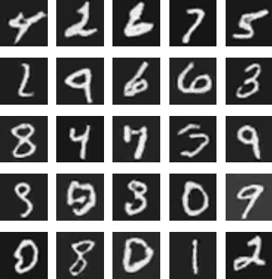
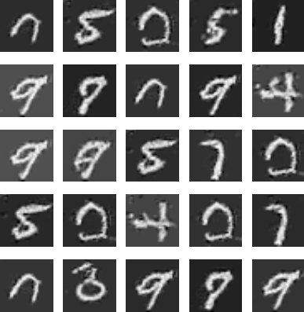

# Improved Techniques for Training GANs

Chainer implementations of some of the techniques presented in the paper Improved Techniques for Training GANs [https://arxiv.org/abs/1606.03498](https://arxiv.org/abs/1606.03498) on the MNIST dataset.

## Minibatch Discrimination

Comparison of random samples created by generators with and without minibatch discrimination. The generators were trained for 100 epochs with 60000 images each. Notice that the generator has started to collpase for the regular GAN as some of the samples are almost identical. This is not the case for the improvemed GAN.

### GAN with Minibatch Discrimination



### GAN




## Run

### Train

```bash
python train.py --minibatch-discrimination --out-generator-filename ./trained/generator.model --gpu 0
```

### Generate Images

Generate sample images from random noises using any of the trained models.

```bash
python sample.py --in-generator-filename ./trained/generator_mbd.model --out-filename sample.png
```
